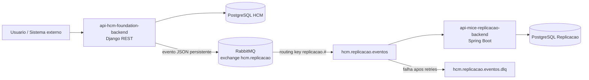
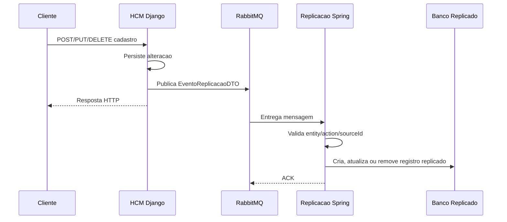

# Trabalho Pratico - Mensageria com RabbitMQ

## 1. Descricao do Cenario

O cenario escolhido e um ambiente corporativo de HCM, no qual o sistema `api-hcm-foundation-backend` centraliza cadastros basicos de paises, estados, cidades, empresas e filiais. O projeto `api-mice-replicacao-backend` consome esses eventos para manter uma base replicada, usada por outros modulos do ecossistema MICE sem depender diretamente da API principal.

A comunicacao assincrona via RabbitMQ e necessaria porque alteracoes cadastrais nao precisam bloquear a resposta da API principal. Quando uma cidade ou empresa e alterada, o HCM publica um evento persistente e responde ao usuario; a replicacao processa a mensagem no seu proprio ritmo. Isso reduz acoplamento, melhora tolerancia a falhas e permite que a replicacao seja retomada caso o consumidor fique temporariamente indisponivel.

## 2. Arquitetura da Solucao

Componentes:

- Produtor: `api-hcm-foundation-backend`, aplicacao Django/DRF responsavel por publicar eventos de CRUD.
- Broker: RabbitMQ, usando exchange do tipo `topic`.
- Consumidor: `api-mice-replicacao-backend`, aplicacao Spring Boot responsavel por consumir eventos e aplicar a replicacao no banco PostgreSQL.
- Banco origem: PostgreSQL do HCM.
- Banco destino: PostgreSQL de replicacao.

Diagrama de componentes:



Fluxo de mensagens:



Tipos de mensagens:

- `CREATE`: criado na origem.
- `UPDATE`: atualizado na origem.
- `DELETE`: removido na origem.

Entidades publicadas:

- `PAIS`
- `ESTADO`
- `CIDADE`
- `EMPRESA`
- `FILIAL`

Formato JSON:

```json
{
  "eventId": "7acb0f31-3e5f-4d6b-9f1f-8a4fd28d7f66",
  "entity": "EMPRESA",
  "action": "UPDATE",
  "sourceId": "15",
  "updatedAt": "2026-05-03T14:20:00.000000",
  "data": {
    "id": 15,
    "legal_name": "Empresa Exemplo Ltda",
    "trade_name": "Exemplo",
    "cnpj": "00.000.000/0001-00",
    "city": 3
  }
}
```

Estrategias de escalabilidade, confiabilidade e tolerancia a falhas:

- Exchange `topic`, permitindo adicionar novas filas consumidoras sem alterar o produtor.
- Mensagens persistentes com `delivery_mode=Persistent` no Django.
- Filas duraveis declaradas no Spring.
- Retry configurado no consumidor Spring com ate 3 tentativas e backoff exponencial.
- Dead letter queue para mensagens que continuam falhando.
- Eventos possuem `eventId` e `sourceId`, permitindo rastreabilidade e idempotencia por entidade de origem.
- Consumidores podem ser escalados horizontalmente usando a mesma fila para distribuir carga.

## 3. Configuracao do RabbitMQ

Parametros definidos:

- Exchange principal: `hcm.replicacao`
- Tipo da exchange: `topic`
- Fila principal: `hcm.replicacao.eventos`
- Binding: `replicacao.#`
- Exchange de dead letter: `hcm.replicacao.dlx`
- Fila de dead letter: `hcm.replicacao.eventos.dlq`
- Retry: 3 tentativas, intervalo inicial de 1000 ms, multiplicador 2 e intervalo maximo de 10000 ms.

Subida local do RabbitMQ:

```bash
docker compose -f docker-compose.rabbitmq.yml up -d
```

Painel de administracao:

- URL: `http://localhost:15672`
- Usuario: `guest`
- Senha: `guest`

Seguranca:

- Em desenvolvimento foi mantido `guest/guest` para facilitar a execucao local.
- Em producao devem ser criados usuarios especificos por aplicacao.
- Permissoes devem limitar o produtor a publicar na exchange `hcm.replicacao`.
- Permissoes devem limitar o consumidor a ler a fila `hcm.replicacao.eventos`.
- O trafego deve usar TLS em ambientes fora da maquina local.
- Credenciais devem ficar em variaveis de ambiente ou secret manager, nao fixas no codigo.

## 4. Exemplos de Uso

Caso 1: Criacao de pais

- Entrada: cliente cria `Country` no Django com `name=Brasil` e `code=BR`.
- Processamento: Django publica evento `PAIS/CREATE`.
- Saida esperada: Spring consome a mensagem e grava ou atualiza `PaisEntity` com `sourceId` do registro original.

Caso 2: Atualizacao de empresa

- Entrada: cliente altera `trade_name` de uma empresa no HCM.
- Processamento: Django publica evento `EMPRESA/UPDATE` com os dados atuais da empresa.
- Saida esperada: Spring localiza a empresa replicada por `sourceId` e atualiza os campos.

Caso 3: Falha temporaria na replicacao

- Entrada: cidade e publicada antes do estado correspondente estar replicado.
- Processamento: consumidor tenta processar, falha por dependencia ausente e o RabbitMQ aplica retry.
- Saida esperada: se a dependencia aparecer dentro das tentativas, a mensagem e processada; caso contrario, vai para a DLQ para analise.

Caso 4: Exclusao de filial

- Entrada: filial removida no HCM.
- Processamento: Django publica evento `FILIAL/DELETE` com `sourceId`.
- Saida esperada: Spring remove a filial replicada correspondente, se existir.

## 5. Consideracoes Tecnicas

Tecnologias utilizadas:

- Python 3, Django 5 e Django REST Framework no produtor.
- Java 17 e Spring Boot 4 no consumidor.
- RabbitMQ como broker de mensageria.
- PostgreSQL como banco das aplicacoes.
- JSON como padrao de mensagens.

Boas praticas adotadas:

- Mensagens pequenas, objetivas e com metadados de rastreio.
- Contrato de evento unico (`EventoReplicacaoDTO`) entre produtor e consumidor.
- Fila e exchanges duraveis para resistir a reinicios do RabbitMQ.
- Retry com backoff para falhas transitorias.
- DLQ para falhas permanentes e auditoria.
- Separacao entre publicacao, transporte e regra de replicacao.
- Logs de publicacao e processamento contendo `eventId`.

## Roteiro para Apresentacao

1. Explicar o problema: replicar cadastros do HCM para o MICE sem acoplamento HTTP direto.
2. Mostrar o diagrama de componentes e o fluxo assincrono.
3. Demonstrar a exchange, fila, binding, retry e DLQ no RabbitMQ.
4. Mostrar o produtor Django publicando eventos no arquivo `core/messaging.py`.
5. Mostrar o consumidor Spring em `RabbitMqReplicacaoConsumer`.
6. Explicar o ganho: desacoplamento, tolerancia a falhas, escalabilidade e rastreabilidade.
